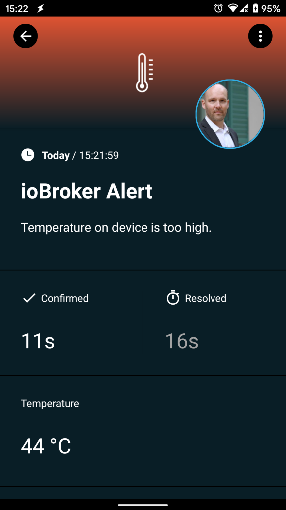

# ioBroker.signl4 - SIGNL4 adapter for ioBroker

Mobile alerting with tracking, duty planning and escalation for ioBroker.

In case of critical incidents in 24/7 IoT or IT operations with ioBroker, SIGNL4 is your tool for instant mobile alerting. SIGNL4 adds critical mobile alerting to ioBroker in no time. It bridges the ‘last mile’ from Node-RED to IoT or IT staff and on-call engineers.

Upon critical events it notifies team members reliably through persistent mobile push, text and voice calls with acknowledgement, tracking and escalation. Built-in duty scheduling provides for convenient on-call planning and seamless routing of critical alerts to the right people at the right time.

SIGNL4 thus provides for an up to 10x faster response to critical alerts, major incidents and urgent service requests.

Download the app and get started at https://www.signl4.com.



## Getting started

....

## Usage

Sample Script:

```
sendTo("signl4", "send", {
	text: 'Temperature on device is too high.',
	subject: 'ioBroker Alert',
	'temperature': '44 °C'
});

log('Sent to SIGNL4');
```

## Changelog

### 0.0.1
* (SIGNL4) initial release

## License
MIT License

Copyright (c) 2020 Derdack GmbH

Permission is hereby granted, free of charge, to any person obtaining a copy
of this software and associated documentation files (the "Software"), to deal
in the Software without restriction, including without limitation the rights
to use, copy, modify, merge, publish, distribute, sublicense, and/or sell
copies of the Software, and to permit persons to whom the Software is
furnished to do so, subject to the following conditions:

The above copyright notice and this permission notice shall be included in all
copies or substantial portions of the Software.

THE SOFTWARE IS PROVIDED "AS IS", WITHOUT WARRANTY OF ANY KIND, EXPRESS OR
IMPLIED, INCLUDING BUT NOT LIMITED TO THE WARRANTIES OF MERCHANTABILITY,
FITNESS FOR A PARTICULAR PURPOSE AND NONINFRINGEMENT. IN NO EVENT SHALL THE
AUTHORS OR COPYRIGHT HOLDERS BE LIABLE FOR ANY CLAIM, DAMAGES OR OTHER
LIABILITY, WHETHER IN AN ACTION OF CONTRACT, TORT OR OTHERWISE, ARISING FROM,
OUT OF OR IN CONNECTION WITH THE SOFTWARE OR THE USE OR OTHER DEALINGS IN THE
SOFTWARE.